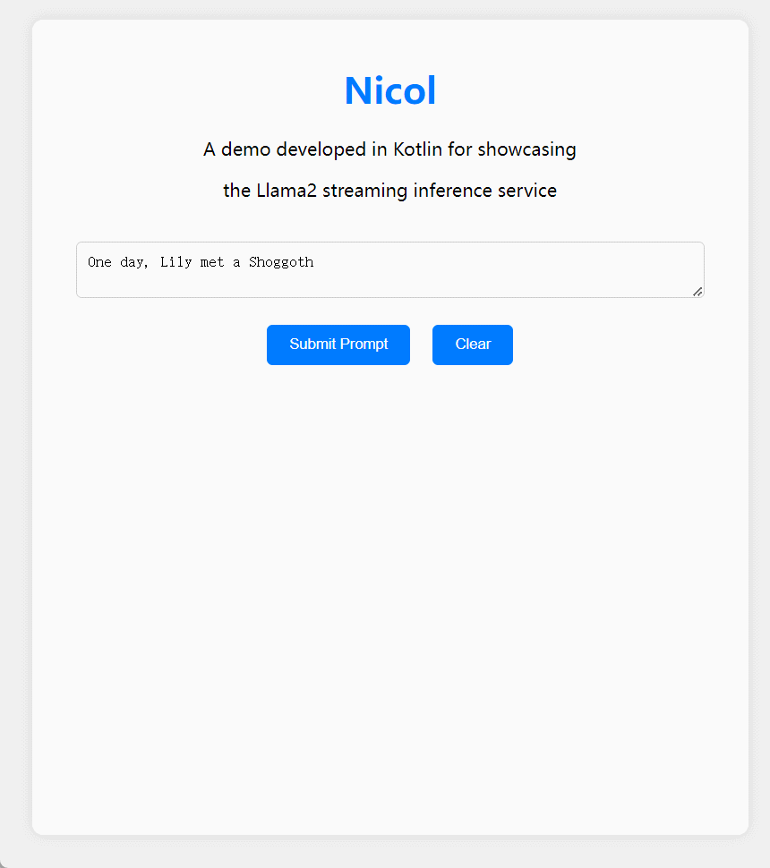
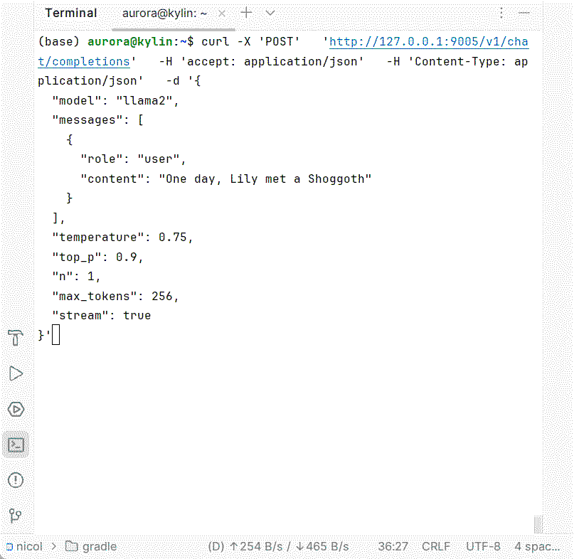

<a name="readme-top"></a>

<div align="center">

<h1>Nicol</h1>
Nicol is an open-source web service, developed using the Kotlin programming language, 

that enables streaming Server Stream Events and supports CPU inference for the port of [llama2.c][babyllama2-link] model.
</div>


## 🌟Features
- [x] 🤖 **Local Model**: A Kotlin port of [llama2.c][babyllama2-link] by @[karpathy][karpathy-link] .
- [x] 🎢 **Server Stream Event**: Implemented a streaming inference interface similar to [OpenAI's][chatcompletionsapi-link] style .
- [x] 🔒 **Authorization**:  Provides basic interface token validation functionality based on the [Spring Framework][springsecurity-link].


## 📸 Snapshot

| Showcasing in Web Demo | Server Stream Event Restful Api                    |
| -------------------------- | -------------------------- |
|    |   |


## 🚀 Quick Start
> **Note**\
> 中国大陆 Ip 请保证网络能够正常访问 Github && Hugging face.\
> China Ip should make sure your network can access Github && Hugging face properly.

### `1` Deploy
```shell
git clone https://github.com/WackyGem/Nicol.git

cd Nicol

docker-compose up
```
### `2` Web
```
// web demo
http://127.0.0.1:8005/

// openapi
http://127.0.0.1:9005/swagger-ui/index.html
```


## 🤝 Thanks 

* 🤖 [llama2.c][babyllama2-link] : Inference a baby Llama 2 model in pure C .
* 💡 [jimmer][jimmer-link] : A revolutionary ORM framework for both java and kotlin, and a complete integrated solution.


---
 <br />

Copyright © 2023 [Wacky Gem][gem-link] . <br />
This project is [MIT](./LICENSE) licensed.

<!-- LINK GROUP -->
[babyllama2-link]: https://github.com/karpathy/llama2.c
[karpathy-link]: https://github.com/karpathy
[chatcompletionsapi-link]: https://platform.openai.com/docs/api-reference/chat/create
[springsecurity-link]: https://github.com/spring-projects/spring-security
[jimmer-link]:https://github.com/babyfish-ct/jimmer
[gem-link]:https://github.com/WackyGem
